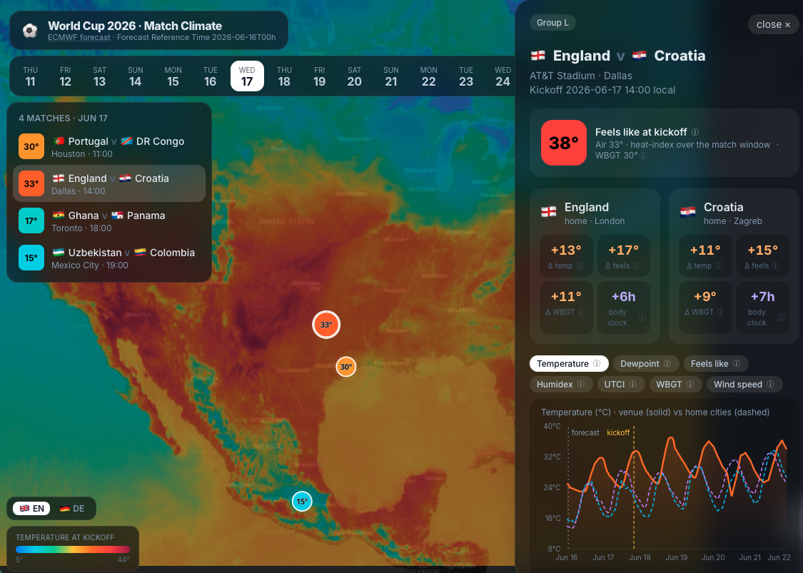

# world-cup-climate

[](https://github.com/aaronspring/world-cup-climate/actions/workflows/pages.yml)



For a World Cup 2026 match **today**, compare the climate at the **match venue** with the
climate in **each competing country's capital** — temperature and how hot it *feels*
(heat index) — for the days around the match.

Data:
- `spring-data/ecwmf-ifs-15-days-forecast-open` (ECMWF IFS-ENS, open) via [Arraylake](https://docs.earthmover.io).
- **Best estimate**: `step="0 days"` across every 6-hourly init → recent conditions up to today.
- **Forecast**: the latest init, steps `0 … 15 days` → the outlook ahead.
- Joined into one continuous line per location.

**Variables (sports-relevant):** `2t` (air temperature) and `2d` (dewpoint) →
relative humidity → heat-stress indices (player heat stress). Both raw fields are
instantaneous, so they are meaningful exactly at `step=0`.

### Indices (webapp)

The match card lets you switch the forecast chart between these indices — the set is
driven by `cycles/latest.json` `variables`, so the webapp renders whatever the backend
emits. Each carries a `label`, `unit` and chart `color`.

| key | label | unit | what it is |
| --- | --- | --- | --- |
| `t2m` | Temperature | °C | 2 m air temperature |
| `d2m` | Dewpoint | °C | temperature at which air saturates — higher = more humid/muggy |
| `heat_index` | Feels like | °C | NOAA heat index (Rothfusz): air temperature + humidity |
| `humidex` | Humidex | °C | Canadian comfort index: air temperature + dewpoint |
| `utci` | UTCI | °C | Universal Thermal Climate Index: temperature, humidity, wind, radiation |
| `wbgt` | WBGT | °C | Wet-Bulb Globe Temperature — the heat-stress standard for sport |
| `wind_speed` | Wind speed | m/s | 10 m wind speed |

The summary stats on each match card are deltas of home capital vs. venue around
kickoff: **Δ temp** (`t2m`) and **Δ feels** (`heat_index`).

## Setup

```bash
uv sync
uv run arraylake auth login   # once; writes ~/.arraylake/token.json
```

## Use

```python
from world_cup_climate.fixtures import load_matches
from world_cup_climate import viz_ifs

match = load_matches("2026-06-15")[0]
viz_ifs.plot_match(match.places(), col="heat_index_c", matchday=match.date)
```

- `ifs.location_series(lat, lon)` → DataFrame (`t2m_c, d2m_c, rh, heat_index_c, is_forecast`), indexed by `valid_time`.
- `ifs.matchday_value(series, matchday, col)` → daily-max on the matchday.
- Fixtures (`data/fixtures.json`) and locations (`data/locations.json`) are curated for the demo.

## Web app (React + MapLibre)

A static single-page app: a date-pickable map of the host cities with a
temperature-colored pin per match. Click a pin (or a match in the list) for a glass
card with venue-vs-home comparison stats and per-variable forecast charts. See
`docs/ARCHITECTURE.md`.

```bash
# 1. generate the per-match JSON the frontend reads (writes frontend/public/data/)
uv run python backend/recompute.py            # --source demo (default, no auth)
uv run python backend/recompute.py --source ifs   # real IFS t2m/d2m (needs Arraylake auth)

# 2. run the frontend
cd frontend
npm install
npm run dev        # http://localhost:5173
```

The committed `frontend/public/data/` is demo data, so `npm run dev` works without
running the backend first. `--source demo` is a physically plausible synthetic
forecast (smooth lat/lon climate field + diurnal cycle); swap in full server-side IFS
extraction for live data. The map basemap uses public CARTO tiles (no token).

## Related projects

Other World Cup 2026 climate/weather efforts. Most use historical climatology or
static analysis; this app's angle is **live IFS forecast data driving per-match
kickoff conditions** (plus the ❄️ badge for air-conditioned retractable-roof venues).

- [Tales of the Stands — Climate Tool](https://talesofthestands.com/world-cup-2026-climate-tool/) — interactive stadium comparison (temperature / humidity / altitude), climatology-based.
- [ClimateCup.org](https://climatecup.org/) — interactive map tracing every World Cup 1930→2022 (temp anomalies, CO₂), then 2026.
- [Climate Central — "Off Your Game"](https://www.climatecentral.org/climate-matters/world-cup-matches) — per-stadium/match/team climate data hub ([stadiums](https://www.climatecentral.org/climate-matters/world-cup-stadiums)).
- [World Weather Attribution](https://www.worldweatherattribution.org/climate-change-big-player-at-fifa-world-cup-2026/) — WBGT increase per venue.
- Forecast/analysis articles: [Bloomberg](https://www.bloomberg.com/graphics/2026-fifa-world-cup-games-weather/), [AccuWeather](https://www.accuweather.com/en/sports/live-news/world-cup-2026-weather-updates-forecasts-for-key-matches-stadium-conditions-and-fan-impacts/1898671).
